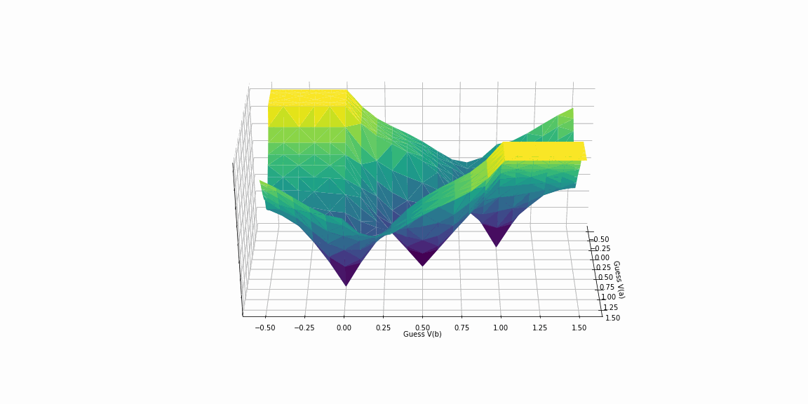

# TeachSpice

A demo-grade analog & transistor-level SPICE-style solver in Python. 

As described in [Analog & Transistor-Level Simulation](https://medium.com/software-makes-hardware/analog-transistor-level-simulation-f15d2a233508) 
on [Medium](https://medium.com/software-makes-hardware). 

